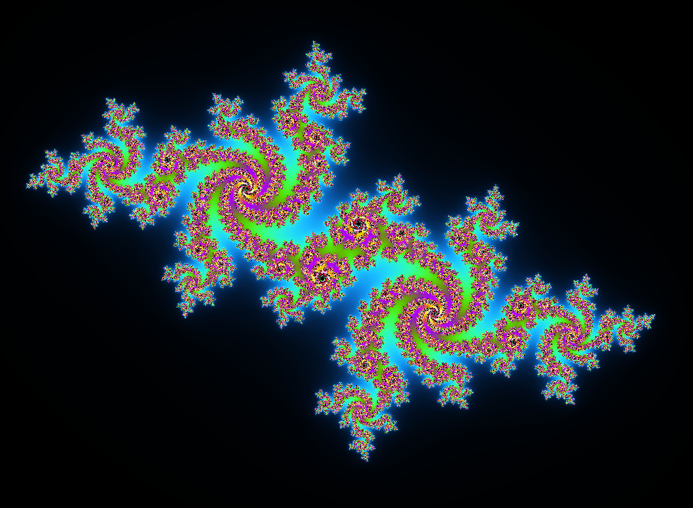
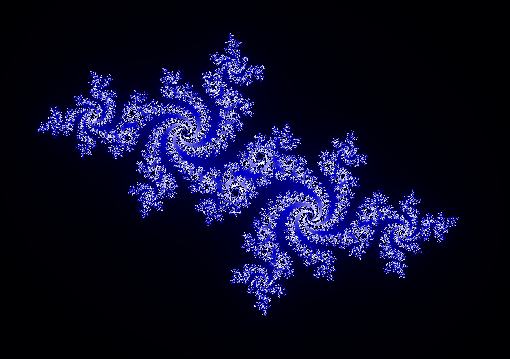
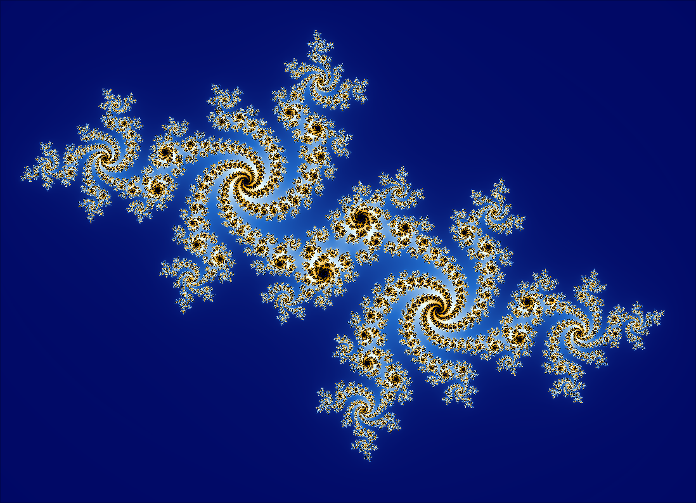
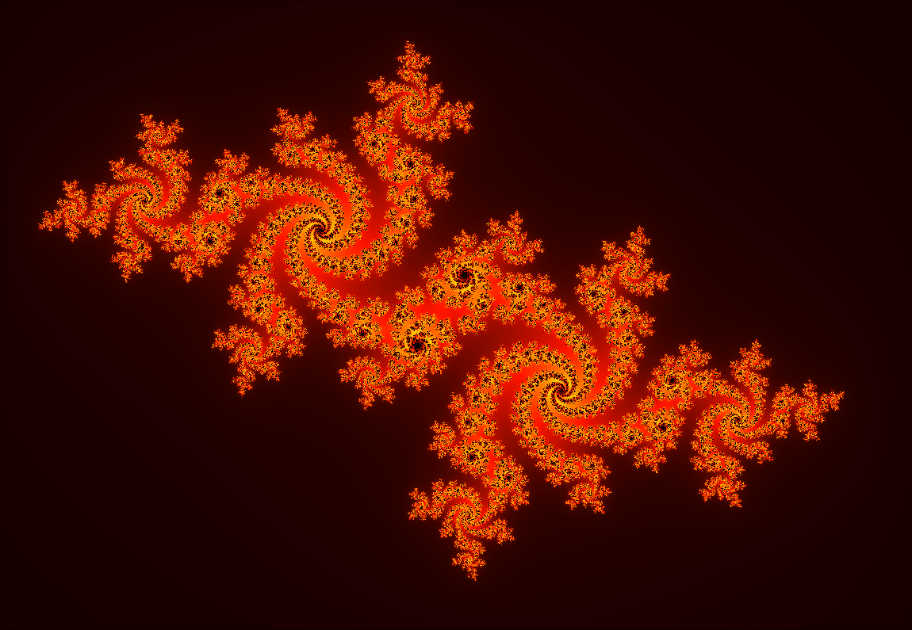
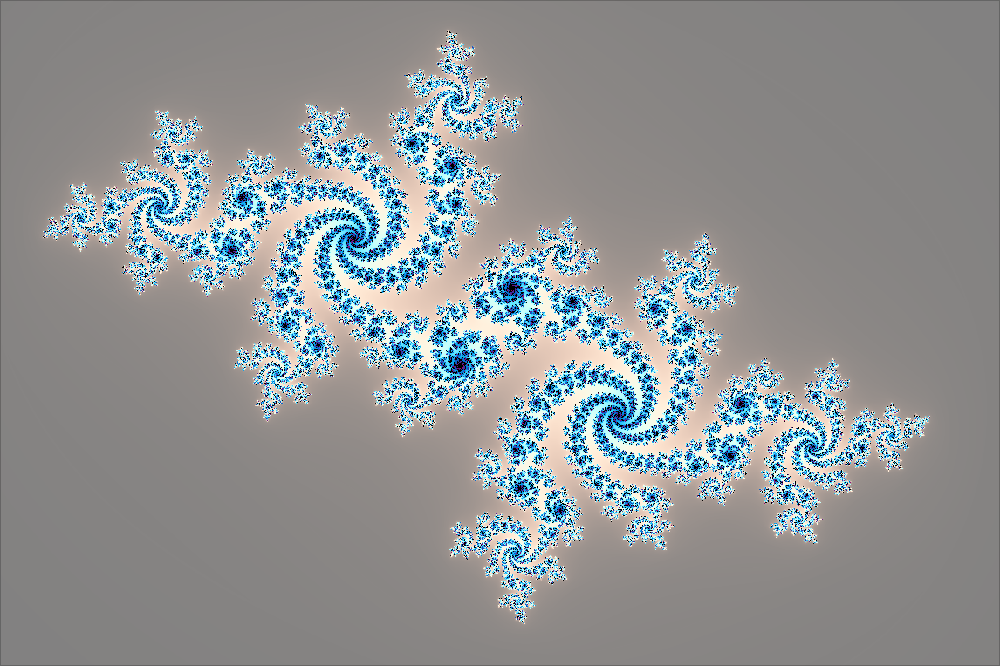
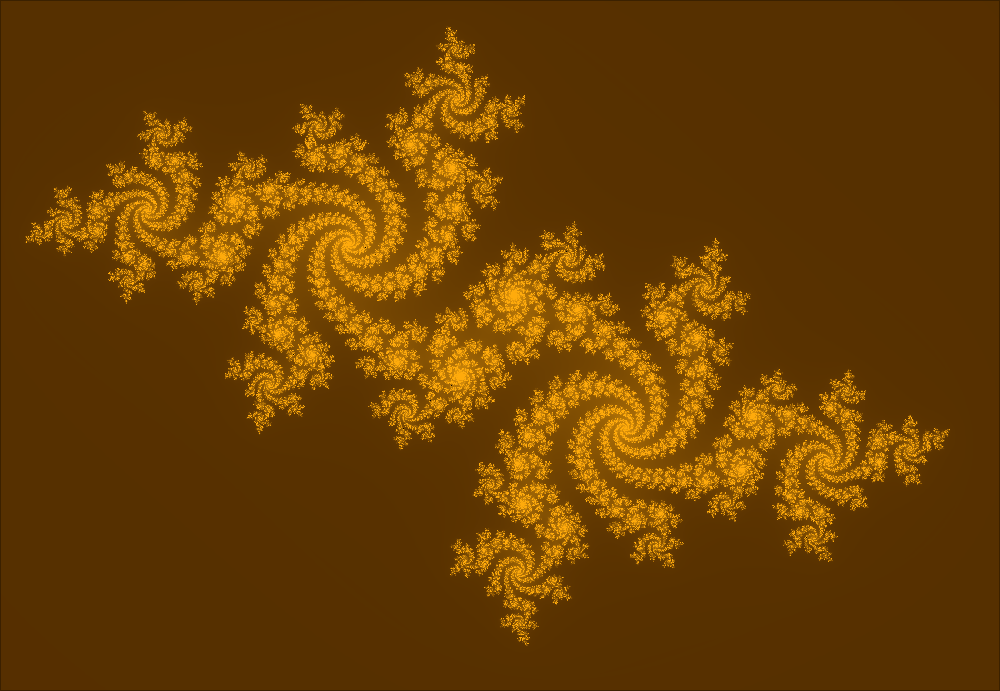
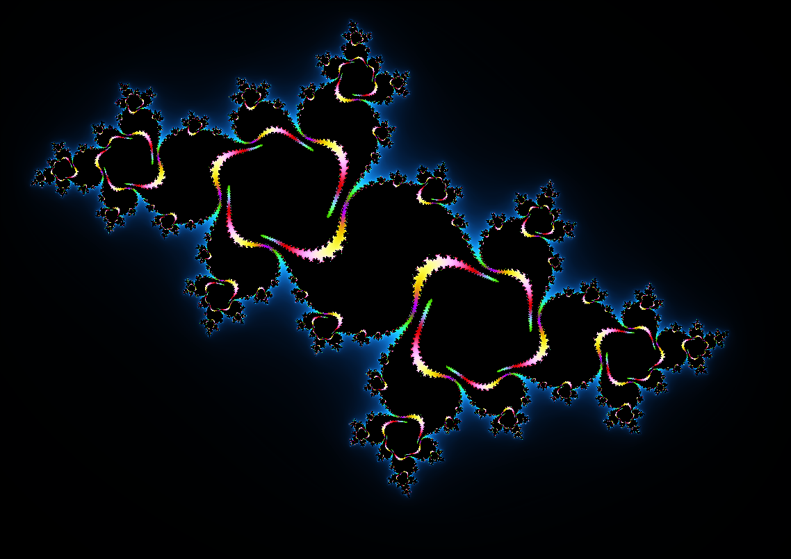

<div align="center"></div>
<h1 align="center">Fractals Explorer</h1>

<div align="center">


<br>


</div>

## Table of contents

- [📖 About](#-about)
- [🌟 Showcase](#-showcase)
    - [Mandelbrot](#mandelbrot)
    - [Julia](#julia)
    - [Burning Ship](#burning-ship)
    - [Newton](#newton)
- [🎨 Color palettes](#-color-palettes)
- [🧪 How to Use](#-how-to-use)
    - [Basic Movements](#basic-movements)
    - [Settings menu](#settings-menu)
- [⌨️ Keybindings](#️-keybindings)
- [🧰 Implementation details](#-implementation-details)
- [✨ Features](#-features)
- [📦 Structure](#-structure)
- [📚 Libraries](#-libraries)
- [🔧 Build](#-build)
    - [Nix (recommended for MacOS and Linux)](#nix-recommended-for-macos-and-linux)
    - [Windows (WSL)](#windows-wsl)
- [🙏 Acknowledgements](#-acknowledgements)
- [📚 Resources](#-resources)
- [🚀 Releases](#-releases)
- [📜 License](#-license)
- [🤩 Gorgeous](#-gorgeous)

## 📖 About

This lightweight C/C++ application lets you generate and explore colorful fractals in real time,
leveraging the power of the GPU. You can zoom in and out and navigate the complex plane using your
mouse.

To enable deep zoom capabilities, the program simulates double-precision calculations on the GPU.
This boosts the accuracy of computations, allowing for much deeper zoom levels.

## 🌟 Showcase

### Mandelbrot


### Julia

<details>
<summary>Settings</summary>
<br>

- **Initial C value**: $0.280 + i0$
- **Color palette**: Original

</details>

 <br>
<br>
<details>
<summary>Settings</summary>
<br>

- **Initial C value**: $-0.561 + i0.527$
- **Color palette**: Original

</details>


### Burning Ship


### Newton

 <br>
<br>


## 🎨 Color palettes

| **Original**                            | **Electrical**                                | **Sky**                         |
| --------------------------------------- | --------------------------------------------- | ------------------------------- |
|  |    |    |
| **Fire**                                | **Shades of Gray**                            | **Gold**                        |
|          |  |  |

## 🧪 How to Use

### Basic Movements

- **Zoom**: Zoom in or out by scrolling forward or backward.
- **Move**: Move in the 2D plane of the window by right-clicking and dragging your cursor.

> [!NOTE]
> By default, all fractals are centered in the window.

---

### Settings menu

When running the program, a sub-window titled **"Simulation Settings"** will appear in your main window. This menu allows you to adjust various parameters:

- **Fractal Type**: Choose which fractal structure to display from a predefined list.
- **Maximum Iterations**: Set the maximum number of iterations for constructing the fractal. This determines the resolution of the displayed fractal. For more details, see [this resource](https://fractalfoundation.org/OFC/OFC-4-1.html).
  > [!WARNING]
  > Since calculations are performed in real-time and recalculated with each zoom change, higher iterations can significantly reduce performance. The deeper you zoom, the more precise (and computationally intensive) the calculations become. This can quickly lead to lag or instability, depending on your GPU's capabilities.

- **Color Palette**: Select from multiple predefined color palettes to customize the fractal's appearance.

> [!NOTE]
> For the **Julia fractal type**, two additional parameters allow you to set the real and imaginary parts of the constant *C* in the Julia set equation.
> For more information, visit [this Wikipedia page](https://en.wikipedia.org/wiki/Julia_set).

## ⌨️ Keybindings

| Key           | Action                                                           |
| ------------- | ---------------------------------------------------------------- |
| Escape        | Close the window.                                                |
| S             | Take a screenshot and save it as `screen_<number>.png`.          |
| R             | Reset the view (zoom, position, iterations, and Julia constant). |
| Right Arrow   | Cycle forward through color palettes.                            |
| Left Arrow    | Cycle backward through color palettes.                           |
| Up Arrow      | Increase the number of iterations.                               |
| Down Arrow    | Decrease the number of iterations.                               |
| Space         | Zoom in (hold Shift to zoom out).                                |
| Z             | Move the view upward (increase imaginary coordinate).            |
| S (hold)      | Move the view downward (decrease imaginary coordinate).          |
| Q             | Move the view leftward (decrease real coordinate).               |
| D             | Move the view rightward (increase real coordinate).              |
| Right Mouse   | Click and drag to pan the view.                                  |
| Mouse Wheel   | Scroll up to zoom in, scroll down to zoom out.                   |
| Shift + Space | Zoom out (instead of zooming in).                                |

## 🧰 Implementation details

Since this section could grow rapidly in size, refer to the details [right here](./doc/implementation.md).

## ✨ Features

- **Project**

    - 🔄 **Reproducible**: Built with Nix, this configuration can be effortlessly reproduced on other
    machines, ensuring a consistent setup.
    - 📖 **Documented**: Most of the parts of my configuration files are commented and documented with
    links and explanations if necessary

- **Application**

    - 🌀 **Real-time fractal generation**: Utilizes GPU acceleration to render fractals instantly.
    - 🎨 **Colorful visualizations**: Generates vivid, dynamic color schemes for fractals.
    - 🖱️ **Interactive exploration**: Navigate the complex plane with your mouse — zoom in, zoom out,
    and pan smoothly.
    - 🔍 **Deep zoom support**: Emulates double-precision floating point on the GPU to allow
    ultra-deep zoom levels without significant loss of precision.

## 📦 Structure

- **Directories**

    - [**`src`**](./src/) - Source files (`.cpp`)
    - [**`libs`**](./libs/) - External libraries
    - [**`assets`**](./assets/) - Images and Shaders
    - [**`build`**](./docs/) - CMake build files

- **Files**

    - `flake.nix` - Environment configuration (based on
    [**dev-templates**](https://github.com/the-nix-way/dev-templates))
    - `.envrc` - Used by **direnv** to load **Flakes**
    - `flake.lock` - Used by **Flakes** to version packages
    - `CMakeLists.txt` -  CMake configuration to build the project

## 📚 Libraries

- [**Dear ImGui**](https://github.com/ocornut/imgui) ~ Bloat-free Graphical User interface for C++
  with minimal dependencies
- [**SFML**](https://github.com/SFML/sfml) ~ Simple and Fast Multimedia Library
- [**GLAD**](https://glad.dav1d.de/) ~ OpenGl loader

> [!NOTE]
>
> Looking at the source code of [SFML](https://github.com/SFML/SFML), it appears that **stb** and
> **GLAD** are already included (but I keep them here anyway).

## 🔧 Build

### Nix (recommended for MacOS and Linux)

> [!NOTE]
>
> I'm using NixOS as my day-to-day OS, and I have found that **Nix** with **Flakes** was the
> simplest and fastest way for me to setup C/C++ project with external libraries.

To build this project, first make sure you have [Nix](https://nixos.org/download/) installed as a
package manager and [direnv](https://direnv.net/) as a shell extension.

Then, configure it to enable [Flakes](https://nixos.wiki/wiki/flakes) according to your setup.

Once you're ready, you can start by cloning this repo

```bash
git clone https://github.com/leoraclet/fractals-generator
cd fractals
```

> [!TIP]
>
> Now, **direnv** should load the environment when inside the project directory, if not, try
>
> ```bash
> direnv allow
> ```

The `flake.nix` file is where the project's environment is defined, and you can see in it that
[CMake](https://cmake.org/) is part of the packages. So, if everything went well, you should be able
to build the project like so

```bash
cmake -B build -S .
cd build
cmake --build .
```

Then, you can run the produced executable in `build` with

```bash
cd build/   # Move to build directory
./fractals  # Run executable
```

> [!CAUTION]
> While the previous steps should work as expected, running `fractals` from a different location may cause issues.
>
> Always ensure the `shaders` directory — containing shader files — is placed in the same directory as the executable.
> Without these files, the program will fail to locate the necessary resources.

### Windows (WSL)

> [!WARNING]
>
> I have **NOT** tested the building process on Windows, so you're basically on your own for this.

The best solution to build this project on Windows is to use
[WSL](https://learn.microsoft.com/en-us/windows/wsl/install) and follow the
[Nix](#nix-recommended-for-macos-and-linux) way in it.

You can start by installing nix [over here](https://nixos.org/download/#nix-install-windows).

## 🙏 Acknowledgements

Thanks to [Henry Thasler](https://github.com/henrythasler) for those great articles (part of a serie) that tought me a lot

- [Heavy computing with GLSL - Part 1](https://blog.cyclemap.link/2011-05-31-glsl-part1/)
- [Heavy computing with GLSL - Part 2](https://blog.cyclemap.link/2011-06-09-glsl-part2-emu/)
- [Heavy computing with GLSL - Part 3](https://blog.cyclemap.link/2011-07-12-glsl-part3-hwdouble/)
- [Heavy computing with GLSL - Part 4](https://blog.cyclemap.link/2011-07-24-glsl-part4-nvidia/)
- [Heavy computing with GLSL - Part 5](https://blog.cyclemap.link/2012-02-12-part5/)

Thanks to the original concept and the Fortran / C++ sourcecode that was developed by Yozo Hi, Xiaoye S. Li and David H. Bailey at Berkeley

- [Library for Double-Double and Quad-Double Arithmetic](https://www.davidhbailey.com/dhbpapers/qd.pdf)
    - [A double-double and quad-double package for Fortran and C++](https://github.com/BL-highprecision/QD)
- [Quad-Double Arithmetic: Algorithms, Implementation, and Application](https://www.davidhbailey.com/dhbpapers/quad-double.pdf)

Thanks to [Eric Bainville](https://www.bealto.com/cv.html) for those amazing pages ([CPU/GPU Multiprecision Mandelbrot Set](https://www.bealto.com/mp-mandelbrot_intro.html))

- [Fixed-point reals](https://www.bealto.com/mp-mandelbrot_fp-reals.html)
- [Vectorized fp128 for OpenCL](https://www.bealto.com/mp-mandelbrot_fp128-opencl.html)

Finally, some features were inspired from [this website](https://oriont.net/newtonfractal/)

## 📚 Resources

> [!NOTE]
> You can find the mentionned papers under `doc/pdfs` [right there](./doc/pdfs/)

- [Heavy computing with GLSL](https://blog.cyclemap.link/2011-05-31-glsl-part1/)
- [CPU/GPU Multiprecision Mandelbrot Set](https://www.bealto.com/mp-mandelbrot_intro.html)
- [Library for Double-Double and Quad-Double Arithmetic](https://www.davidhbailey.com/dhbpapers/qd.pdf)
- [Quad-Double Arithmetic: Algorithms, Implementation, and Application](https://www.davidhbailey.com/dhbpapers/quad-double.pdf)
- [Algorithms for Quad-Double Precision Floating Point Arithmetic](https://www.davidhbailey.com/dhbpapers/arith15.pdf)
- [Wikipedia - Buddhabrot](https://en.wikipedia.org/wiki/Buddhabrot)
- [Wikipedia - Plotting algorithms for the Mandelbrot set](https://en.wikipedia.org/wiki/Plotting_algorithms_for_the_Mandelbrot_set)
- [Stack Exchange - Zoom to cursor calculation](https://gamedev.stackexchange.com/questions/9330/zoom-to-cursor-calculation)
- [Stack overflow - How does C compute sin() and other math functions?](https://stackoverflow.com/questions/2284860/how-does-c-compute-sin-and-other-math-functions)
- [C++11 library for double-double (emulated quad precision) arithmetic](https://github.com/tuwien-cms/libxprec/blob/mainline/src/sqrt.cpp)
- [A double-double and quad-double package for Fortran and C++](https://github.com/BL-highprecision/QD)
- [A mostly branchless and somewhat efficient implementation of arbitrary precision fixed point numbers in GLSL](https://github.com/minerscale/arbitrary-fixed-glsl)
- [Fork of Henry Thasler's quadruple precision GLSL Mandelbrot demo](https://github.com/10110111/QSMandel)
- [An arbitrary-precision arithmetic library for GLSL](https://github.com/RohanFredriksson/glsl-arbitrary-precision)
- [Generate a high resolution, deep mandelbrot zoom](https://github.com/josch/mandelbrot)
- [quadmath_snprintf (GCC libquadmath)](https://gcc.gnu.org/onlinedocs/libquadmath/quadmath_005fsnprintf.html)

## 🚀 Releases

To run the program without editing the source code or building it yourself, go see the
[**Releases**](https://github.com/leoraclet/fractals-generator/releases).

> [!CAUTION]
> I’ve built a Windows-compatible executable for this project using Visual Studio in a custom Windows VM. Since it requires GPU support, I wasn’t able to test it directly — I didn’t set up GPU pass-through. However, it *should* work on a native Windows system (fingers crossed).
>
> **Important:** Make sure to run the executable from the same directory as the DLL files. The build isn’t static, so it will crash if it can’t find the required libraries. Looking forward to a static build in the future!

## 📜 License

This project is licensed under the MIT License - see the [LICENSE](LICENSE) file for details.

## 🤩 Gorgeous


